# The Binding of dodo

一个致敬《以撒的结合》(The Binding of Isaac) 的俯视角肉鸽地牢网页游戏。
操控 dodo 在随机生成的地牢里探索，用眼泪消灭敌人，拾取道具滚雪球变强，打穿 12 层。
**12 层地牢、13 个 Boss、41 种专属招式、9 种敌人、89 件道具、5 个可选角色**，
所有图形由 Canvas 代码绘制，所有音效由 WebAudio 实时合成，仓库里没有一张图片、一个音频文件。

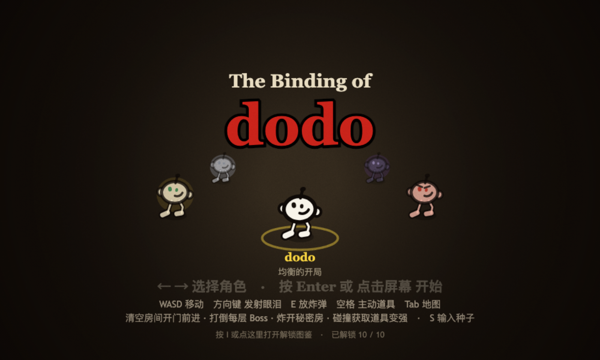

> 一句话总结：约 9500 行原生 JavaScript，零依赖、零构建、零素材文件，
> 双击 `index.html` 就能玩完整的 12 层肉鸽，另有 3100 行 Playwright 测试盯着它别坏。

**在线试玩**：[the-binding-of-dodo.popo.baidu-int.com](https://the-binding-of-dodo.popo.baidu-int.com)（内网，带全服排行榜）

先看两段实机动图。普通战斗，三连射清房：

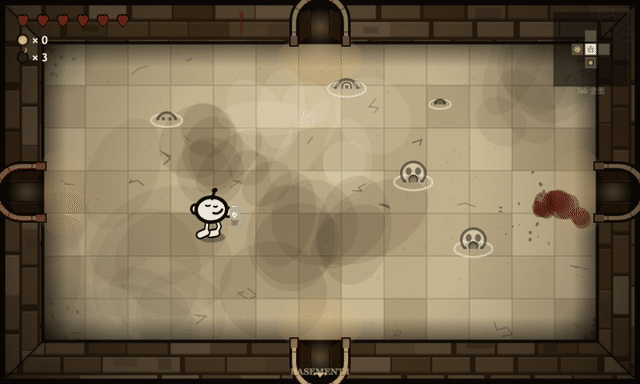

第 8 层 WOMB II 的 Boss 战，Sanguino：

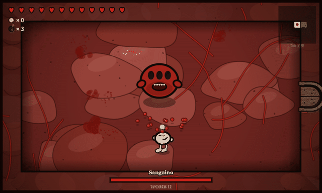

---

## 这个项目是怎么做出来的

整个游戏由 AI 编程完成：从地牢生成算法、13 个 Boss 的状态机，到 89 件道具的程序化图标和排行榜后端对接，我只负责提需求和验收。逻辑问题靠 `test/playtest.cjs` 里的 318 条断言抓：真键盘事件驱动 file:// 页面，对活的游戏状态做检查，凡是「改了个函数名忘了改调用点」这种错，几秒内就会翻车。美术问题断言抓不住，只能出图人工看，本 README 的所有截图和动图也是同一套摆拍脚本产出的。

版本演进记录在 [CHANGELOG.md](CHANGELOG.md)，从 v0.1 的单层原型一路到现在的 v0.8。

---

## 快速开始

不用装任何东西，拉取本项目后直接打开 `index.html` 就可游玩，或者直接**在线试玩**：[the-binding-of-dodo.popo.baidu-int.com](https://the-binding-of-dodo.popo.baidu-int.com)（内网，带全服排行榜）

没有构建步骤、没有 npm 依赖。脚本全部是普通 `<script>` 标签而非 ES module，
正是为了保证 `file://` 直开可玩。排行榜依赖线上接口，本地打开时会自动隐藏。

## 操作

| 平台 | 移动 | 射击 | 其他 |
| --- | --- | --- | --- |
| 桌面端 | WASD | 方向键 ↑↓←→（四向） | P 暂停 · E 炸弹 · 空格 主动道具 · Tab 全图 · I 解锁图鉴 |
| 移动端 | 左侧虚拟摇杆 | 右侧四向按钮 | 「炸弹」「道具」悬浮按钮 · 左上角「暂停」「图鉴」· 点右上角小地图看全图 |

标题界面：5 个角色站成一圈，←/→ 转动圆环选人，也可以直接点头像，Enter 或点击屏幕开始；
按 I 打开解锁图鉴（对局中也能随时按 I 查看，游戏会自动暂停，关闭即恢复），
按 S 输入自定义种子（种子局不上排行榜、不计解锁）。

暂停界面显示六维属性、当前生效的眼泪效果和已拾取道具。切走窗口会自动暂停，
敌人、弹幕、计时全部冻结，回来按 P 继续，按住的键会被释放，不会漂移。

移动端按横屏设计：竖屏会弹出转屏提示并自动暂停，横过来即可继续。控件长什么样、
小屏怎么适配，见下面的「移动端」一节。

---

## 移动端

页面检测到触摸屏就会浮出一套控件：左手摇杆、右手四向射击键，中间是「炸弹」「道具」，
左上角两枚图标石牌管暂停和解锁图鉴。样式跟着游戏走暗色石板，半透明，
脚下的地板、血迹和飞过来的弹幕都还看得清。

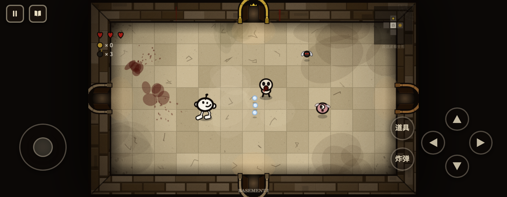

点右上角的小地图会展开本层全图，同时把对局冻住。手指点开地图的时候没法同时躲弹幕，
不冻结就是白送伤害。面板打开时摇杆和射击键自动收起，免得压住内容，点屏幕任意处继续。

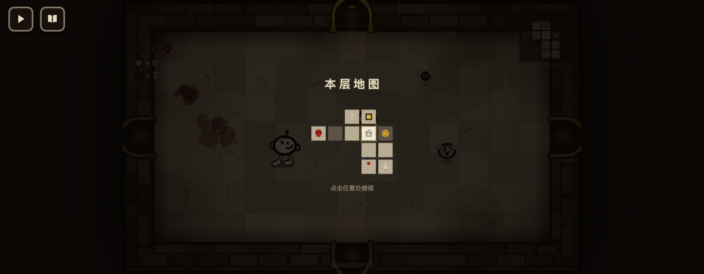

### 画面太小、按钮太大

第一次在手机 Safari 里试玩就撞上这个：浏览器工具栏吃掉四分之一高度，剩下的地方还要
塞进摇杆和四个射击键，游戏画面被挤成中间一条。拆开看是三件事，处理方式各不相同。

控件尺寸原来写死在 CSS 里，摇杆 120px、射击键 60px，屏幕越矮占比越夸张。现在统一交给
一个变量 `--ctl: clamp(30px, 12svh, 56px)`，所有按钮和间距都是它的倍数：横屏 390px 高时
射击键 47px，被工具栏压到 300px 就缩成 36px。摇杆内部那几个位移量也改成实测元素尺寸，
不再依赖固定像素，否则尺寸一变摇杆中心就偏。

画面被工具栏切掉是另一码事。iOS 的 `100vh` 算的是工具栏收起后的高度，比实际可视区要高，
canvas 于是有一截被顶到屏幕外面，最底下那行文档链接只剩半截。改用 `100svh` 之后画面小了一点，
但是完整的了。

真正占地方的是浏览器外壳本身，这部分只能绕开。页面声明了 `apple-mobile-web-app-capable`，
iOS 上「添加到主屏幕」再打开就是全屏应用，地址栏和标签栏都没了，画面立刻大一圈；
安卓端首次触摸会尝试 `requestFullscreen` 并锁定横屏。这是画面变大最直接的一步，
真要在手机上打通关，建议先加到主屏幕。

---

## 系统清单

### 12 层地牢

每层随机生成 5-10 个普通房间，外加固定的 Boss 房和宝藏房；商店、诅咒房、挑战房、
秘密房、献祭房、小 Boss 房看运气。八个视觉章节各有独立配色和地面烘焙，
WOMB 两层干脆不铺地砖，改画层叠血肉和爬行的血管。

| 层 | 章节 | Boss |
| --- | --- | --- |
| 1 - 2 | BASEMENT I / II | Gluttono · Duodeno |
| 3 - 4 | CAVES I / II | Larvato · Chubbler |
| 5 - 6 | DEPTHS I / II | Osseo · Mortuum |
| 7 - 8 | WOMB I / II | Utero · Sanguino |
| 9 | SHEOL | Infernus |
| 10 | CATHEDRAL | Seraphim |
| 11 | THE CHEST | Auricus |
| 12 | DARK ROOM | Umbra，随后 MEGA dodo 现身 |

每进一层，屏幕中央短暂打出楼层横幅：

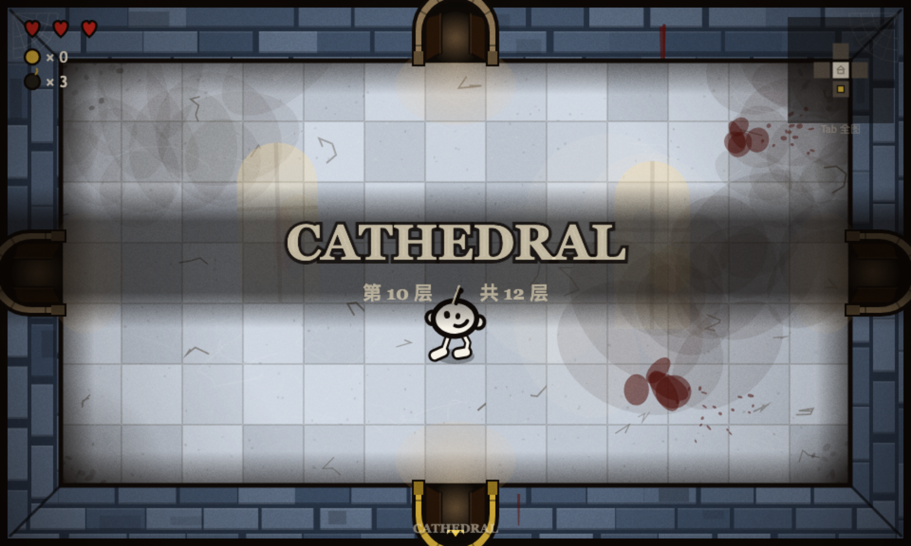

### 种子系统

每局生成 8 位种子（暂停面板可见），同种子等于同楼层布局、同房型、同诅咒、同道具刷法。
标题界面按 S 可以输入任意文字当种子，方便复现或跟朋友打同一局。

### 战斗手感

发射眼泪时 dodo 会眨一下眼。命中敌人画面冻结 2 帧、击杀 4 帧，配合屏幕震动和
永久留在地上的血渍，打击感靠这些细节堆出来。岩石挡普通眼泪，幽灵弹能穿。
敌人进场有 0.55 秒（Boss 0.9 秒）具现化保护期，升起、淡入、光环收缩，期间不动不打人
也不挨打，开门瞬间不会白送一颗心。

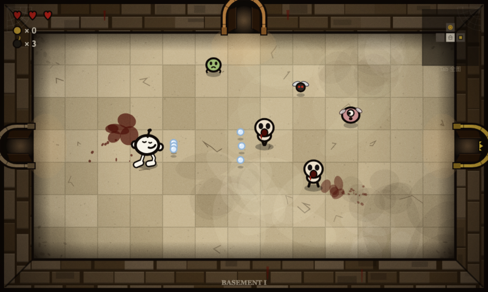

### 敌人（9 种）

| 敌人 | 行为 |
| --- | --- |
| Gaper | 直线追击，看到你后永久加速 |
| Fly | 悬空漂移骚扰 |
| Spitter | 悬停远程吐弹，深层换追踪弹 |
| Hopper | 蓄力后跳跃突进 |
| Sentry | 完全固定，旋转四向十字弹 |
| Boom Fly | 对角弹墙飞行，死亡爆炸波及玩家 |
| Globin | 第一次被杀只会瘫成一滩，随后重组复活 |
| Knight | 正面免伤，必须绕背击杀 |
| Vis | 蓄力后发射贯穿全场的紫色持续激光 |

### Boss（13 个，41 种专属招式）

招式库里每一招只属于一个 Boss，没有两个 Boss 共用同一招，每场 Boss 战都要现学一套躲法。
挑几个说：Duodeno 钻地潜行，土丘追着你跑，钻出时放射爆弹；Osseo 瞬移加骨骼迫击炮，
多点预警圈落弹；Mortuum 的全屏发散持续激光，多束紫色激光预警后整体旋转扫场；
Utero 的收缩弹环带一个安全缺口，逐波旋转；Infernus 的火墙一波比一波宽；
Umbra 半虚体幻影突进加窥视之眼狙击。血量掉到一半进入狂暴，攻击间隔缩短、弹量增加。

第 6 层 Mortuum 狂暴中，激光扫场：

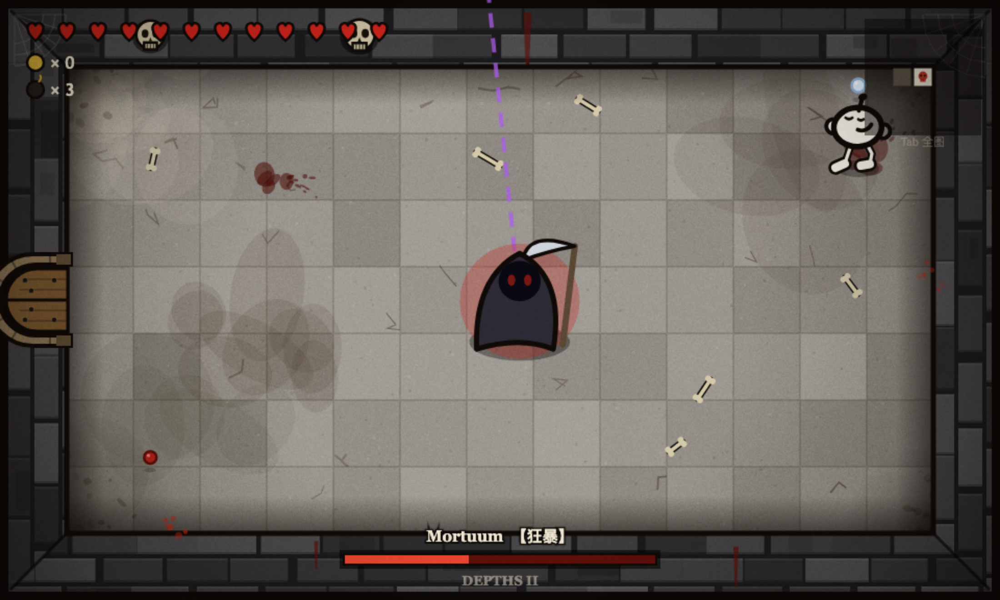

第 12 层击败 Umbra 后，最终 Boss MEGA dodo 直接现身：四臂反转风车、蝇卵炸弹、
追踪巨型光束，狂暴后三个技能同时施放，还有铺满全场只留一个缺口的「天启」轰炸。

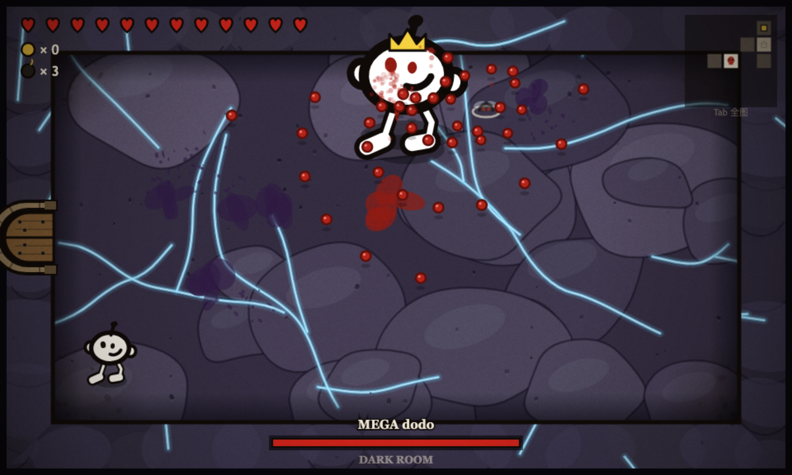

Boss 血量从第 2 层起按每层约 1.32 倍指数增长（900 → 20300，最终 Boss 40000 起步），
并且生成时会按你当前 build 的估算 DPS 卡进一条战时走廊：至少打 30 秒，
至多约 40 + 4×层数 秒。低配不会陷入无穷磨血，叠满输出也秒不掉。

### 道具与构筑（89 件）

道具分宝箱池、商店池、恶魔池，各抽各的。35% 的宝藏房是二选一，拿一件另一件消失：

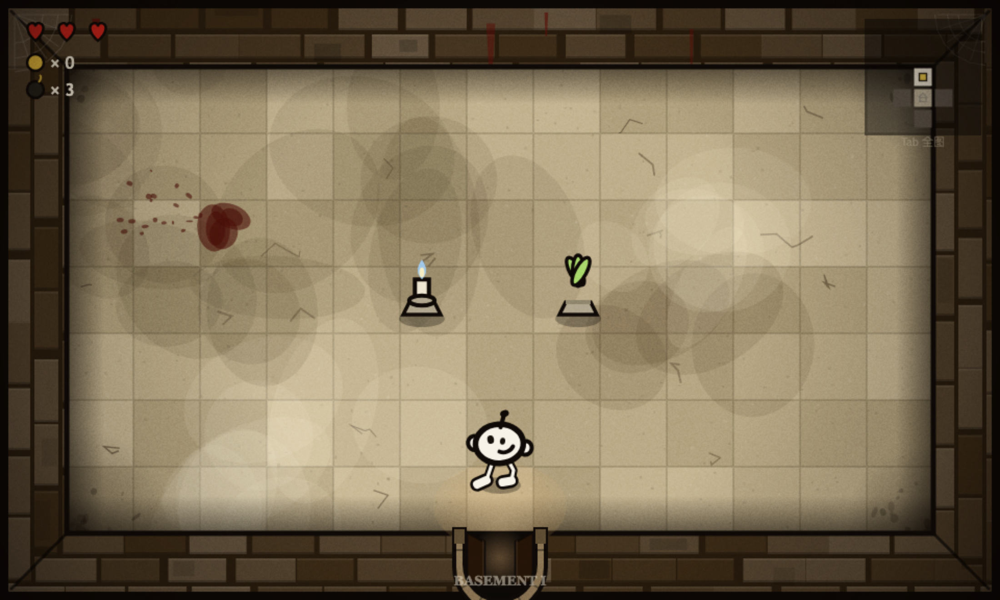

效果可叠加：Brimstone 血腥激光（长按蓄力）、眼泪爆炸（会炸到自己）、落地分裂、弹墙、
中毒、冰冻、幽灵弹、距离伤害、暴击、环绕泪、跟随物、吸血、复活、圣盾、飞行等等。
集齐 3 件同系道具触发转变：羽毛系变「羽翼圣者」，恶魔系变「恶魔化身」，菌菇系变「蘑菇之王」，
外观和能力一起质变。属性有上下限保护，89 件全叠上也不会数值爆炸。

一套成型 build 长这样，dodo 之翼加三束 Brimstone 齐射，带着环绕泪和跟班：

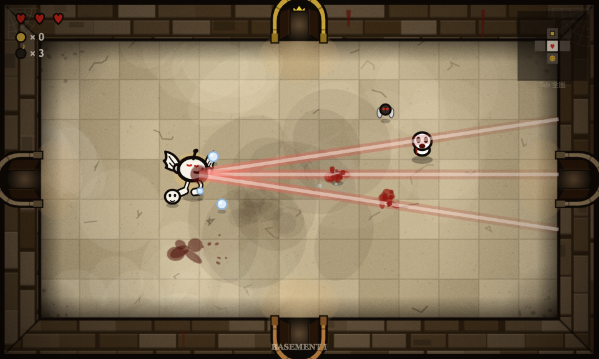

### 恶魔交易与献祭

击败 Boss 后有概率在 Boss 房旁裂开一扇黑门（无伤击杀概率翻倍），
里面两件恶魔池道具，标价 1-2 颗红心上限：

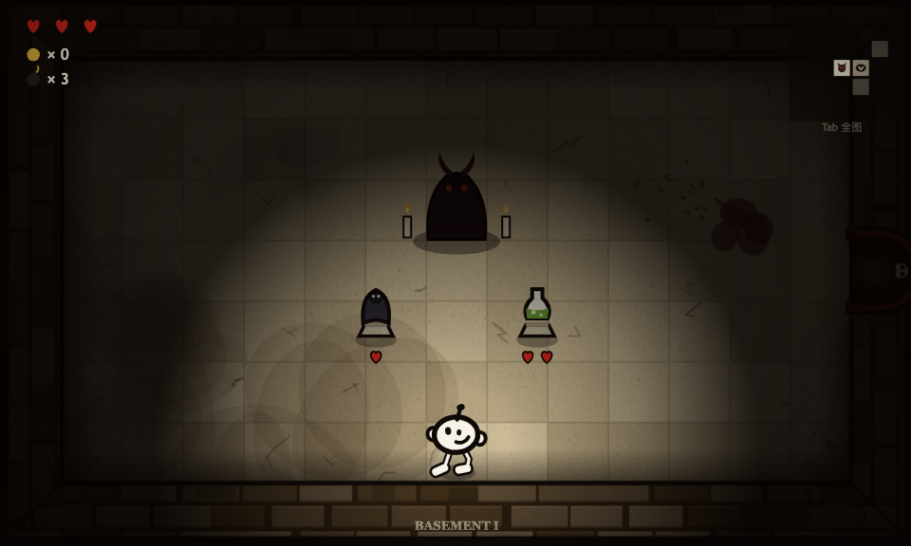

献祭房中央一圈尖刺，踩一次扣一颗心，奖励随次数递进：金币、魂心、道具、恶魔池道具。
飞行也躲不掉献祭的代价。魂心（蓝心）先于红心扣除，上限 6 颗。

### 角色（5 个）

都沿用 dodo 的骨架，89 件道具和全部动画通用，但开局和专属机制完全不同。
dodo 均衡；生气 dodo 靠怒气槽越战越狂，攒满暴走处决残血；暗黑 dodo 是恶魔宠儿，
交易更便宜、击杀收割魂火，代价是 6 件圣物永不进池；迷失 dodo 半颗心一触即死，
换来飞行、幽泪、圣盾和白送的恶魔交易；赌徒 dodo 开局 15 金币商店半价，每层重摇运势。

### 解锁系统（10 条）

6 件强力道具加 4 个角色锁在元进度后面：无伤击败 Boss、无伤走完一层、单局 12 件道具、
通关、累计击杀、累计死亡。达成瞬间弹窗，道具当场发到手里，之后的对局要在地牢里自己刷。
进度存 localStorage，开发者模式和种子局不计。

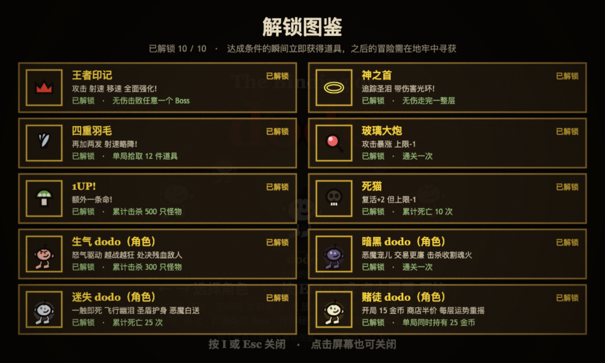

### 诅咒与分岔层

第 2 层起每层 30% 概率带一种诅咒：黑暗（视野只剩身边一圈）、迷失（地图失效）、
未知（血条变问号）。第 4 层和第 8 层打完 Boss 会出现两扇门：安稳门照常下层，
尖刺门进「危险之路」，下层敌人血量 ×1.35、刷怪 +1、Boss 血量 ×1.2，
换宝藏房双道具座和 Boss 双倍奖励。

### 流程与结算

打完每层 Boss 拿奖励道具、踩活板门下层，第 12 层击败 MEGA dodo 通关。
死了也有蜡笔小纸条送你：

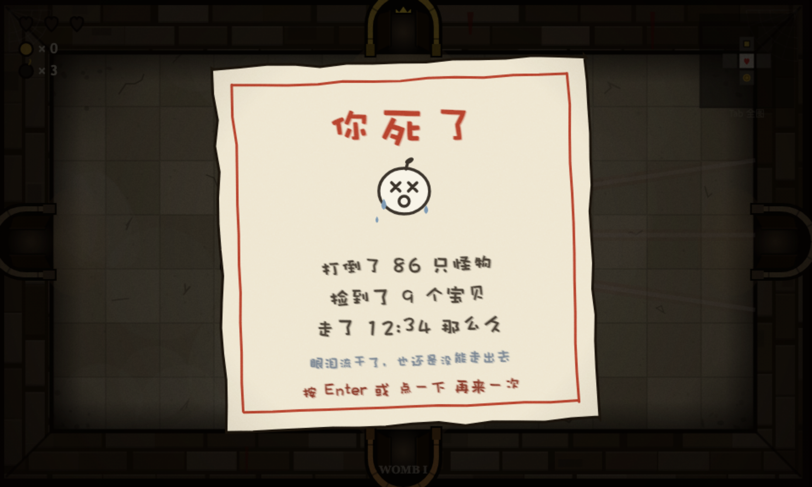

### 排行榜与音效

全服排行榜挂在 popo Runtime 动态数据上，线上版本自动启用，本地 file:// 打开自动隐藏。
音效全部 WebAudio 实时合成：射击、命中、开门、Boss 落地、爆炸（分层合成，
高频爆裂 + 全频冲击 + 次低音重击 + 低频余响）、死亡与通关旋律，没有一个音频文件。

---

## 技术选型

| 项 | 选择 | 理由 |
| --- | --- | --- |
| 渲染 | 原生 Canvas 2D，手写游戏循环 | 素材全部代码绘制，程序化绘图本身就是主要工作量，框架帮不上忙 |
| 语言 | 原生 JavaScript，普通 `<script>` 标签 | 交付要求双击 `index.html` 直接玩，ES module 在 `file://` 下会被浏览器拦 |
| 分辨率 | 固定 960×576，CSS 缩放适配 | 所有坐标可写死，移动端和桌面共用一套逻辑 |
| 随机数 | 种子化 PRNG | 同种子同地牢，测试和 bug 复现都靠它 |
| 音效 | WebAudio 程序化合成 | 同样为了零素材文件 |
| 测试 | Node + Playwright，借全局 `@playwright/cli` 的运行时 | 真键盘真触控驱动页面，项目本体保持零依赖 |

## 代码结构

```
.
├── index.html      入口页面 + 移动端触控 UI
├── style.css       布局 / 暗色石板触控按钮 / 竖屏转屏提示
├── js/
│   ├── 基础
│   │   ├── utils.js                  数学工具 / 常量 / 种子随机
│   │   ├── meta.js                   元进度（解锁 / 角色定义 / localStorage 存档）
│   │   └── audio.js                  WebAudio 合成音效
│   ├── 绘制（全 Canvas 代码绘制）
│   │   ├── sprites-room.js           房间绘制（石墙与血肉章节烘焙、岩石、门、配色）
│   │   ├── sprites-actors.js         角色与敌人绘制（dodo / 翅膀 / 眼泪 / 激光）
│   │   ├── sprites-items.js          拾取物 / 道具座 / 商店 / 89 件道具图标
│   │   └── sprites-fx.js             后期特效（暗角 / 颗粒）、蜡笔文字、HUD
│   ├── 数据与玩法
│   │   ├── items.js                  89 件道具定义与效果
│   │   ├── char-powers.js            角色专属机制（怒气 / 魂火 / 恶魔定价 / 赌徒运势）
│   │   └── dungeon.js                随机地牢生成 + 小地图
│   ├── 实体
│   │   ├── entities-player.js        玩家 / 眼泪 / Brimstone 激光 / 爆炸 / 粒子
│   │   └── entities-enemies.js       敌人 AI / 敌方弹幕与激光 / 受击结算
│   ├── Boss
│   │   ├── boss-core.js              13 个 Boss 定义、血量曲线、状态机
│   │   ├── boss-attacks.js           通用攻击行为库
│   │   ├── boss-attacks-signature.js  各 Boss 专属招式（每招只属于一个 Boss）
│   │   └── boss-render.js            Boss 绘制
│   └── 界面与流程
│       ├── leaderboard.js            全服排行榜（本地打开自动隐藏）
│       ├── menu-unlocks.js           环形选人 / 解锁图鉴（I 键，局内可随时查看）/ 解锁弹窗
│       ├── game-core.js              全局状态 / 输入 / 暂停 / 触控
│       ├── game-flow.js              局与楼层流程（开局 / 进房 / 清房 / 下层）
│       ├── game-update.js            每帧逻辑更新
│       ├── game-render.js            场景渲染 / HUD / 楼层横幅
│       └── game-screens.js           标题 / 结算 / 暂停界面与主循环
└── test/           Playwright 自动化测试与 README 配图脚本
```

游戏本体约 9500 行（js 9338 + css 99 + html 54），测试另有约 3200 行。

---

## 自动化测试

```bash
node test/playtest.cjs            # 无头跑全部断言
node test/playtest.cjs --headed   # 打开浏览器观察
```

用 Playwright 以 `file://` 打开页面、发真实键盘事件，对活的游戏状态做断言，
不是纯单元测试。当前 **326 / 326 通过**，覆盖：

- 交付形态：无 module、无 npm、双击可玩；启动、移动、射击、暂停与切窗自动暂停、
  解锁图鉴（I 键，菜单与局内）、移动端触控按钮存在性与竖屏提示
- 结构：12 层配色、13 Boss 全部专属攻击各模拟 420 帧、89 件道具图标绘制与效果叠加
- 地牢合法性：12 层 × 25 次生成，连通性、双向门、岩石不堵门
- 机制专项：指数难度曲线、Boss 血量走廊、激光蓄力门控、骑士格挡、Globin 重组、
  恶魔定价、献祭递进、三种转变、三种诅咒、五角色专属机制、分岔层、解锁条件
- 稳定性：满屏弹幕帧率下限、12 层完整通关流程、控制台零报错

README 里的截图和动图也是脚本摆拍的，改了画法可以随时重制：

```bash
node test/readme-shots.cjs        # 10 张场景截图 -> screenshots/
node test/gif-frames.cjs          # 冻结时间逐帧抓 GIF 帧序列
python3 test/make-gifs.py         # Pillow 拼装 GIF（需要系统 Pillow）
```

抓 GIF 时会劫持页面的 requestAnimationFrame 手动喂帧：每截一张图游戏只前进 1/15 秒，
无头截图再慢，回放也是稳定的实时速度。

---

## 已知限制

- 排行榜接口在内网，外网环境等于纯单机（游戏本身不受影响）。
- 房间只有标准 1×1 一种形状，没有原作 Rebirth 的 2×2 和 L 形异形房。
- 每层 Boss 固定，不像原作是从池子里抽。想要的随机性目前给了道具和房型。
- 难度按「会走位的普通人」标定。真正的原作老手拿到 Brimstone 之后，中期大概率碾过去。

## 致敬与免责

本项目是对 Edmund McMillen 与 Florian Himsl 的《The Binding of Isaac》的致敬性同人作品，
与原作者、发行商均无关联，未获其授权。仓库里所有图形都是 Canvas 现场画的，
所有音效都是 WebAudio 现场合成的，不含任何一份原作的美术、音频或代码资源。
喜欢这套玩法的话，请去支持[原作](https://store.steampowered.com/app/250900/)。
